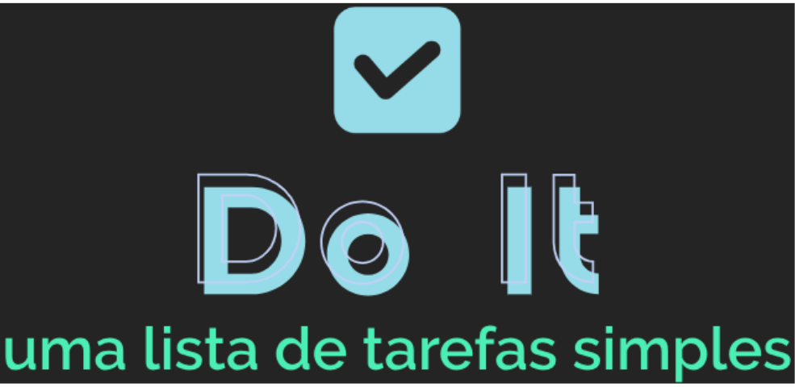
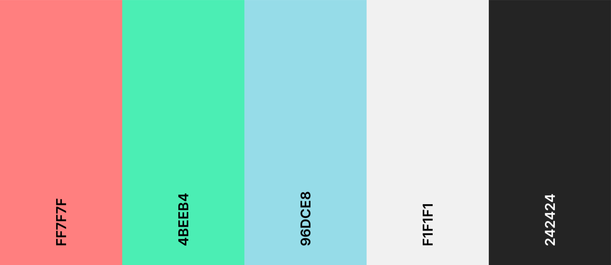

<p align="center"></p>

<hr>

<h1 align="center"> To-do List | Do It </h1>

<p align="center"> </p>

### Tópicos

- [Resumo do projeto](#resumo-pencil)

- [Descrição do projeto](#descrição-page_facing_up)

- [Funcionalidades do projeto](#funcionalidades-hammer_and_wrench)

- [Técnicas e tecnologias utilizadas no projeto](#técnicas-e-tecnologias-utilizadas-desktop_computer)

- [Paleta de Cores utilizada no projeto](#paleta-de-cores-art)

- [Requisitos para utilizar o projeto](#pré-requisitos-warning)

- [Instalação do projeto](#como-instalar-building_construction)

- [Acesso ao projeto](#acesso-open_file_folder)

- [Desenvolvedora do projeto](#desenvolvedora-octocat)

## Resumo :pencil:

<p align="justify"> Aplicativo To-do List capaz de permitir que o usuário gerencie sua lista de tarefas de forma simples e eficiente.</p>

## Descrição :page_facing_up:

<p align="justify"> O app <b>Do It - Lista de Tarefas</b> foi desenvolvido para a avaliação "Projeto Individual - Javascript e React: Lista de Tarefas” do "Módulo 5: Frameworks, bibliotecas, tecnologias client-side/front-end + Postura profissional e Inovação" do curso de formação <b>WebDev Full Stack JavaScript</b> da Resilia Educação em parceria com o programa "Códigos do Amanhã" da <b>EBANX</b>.</p>

<b>Link para acessar o app:</b> https://to-do-list-doneit.vercel.app/

## Funcionalidades :hammer_and_wrench:

1. :white_check_mark: `Adicionar itens` Acrescenta novas tarefas à lista de afazeres;
2. :white_check_mark: `Editar itens` Ajusta as tarefas da lista visando atualizações;
3. :white_check_mark: `Deletar itens` Remove as tarefas indesejadas da lista de afazeres;
4. :white_check_mark: `Marcar itens concluídos` Sinaliza com checked as tarefas feitas;
5. :white_check_mark: `Buscar tarefas` Encontra tarefas específicas ao informar texto;
6. :white_check_mark: `Filtrar tarefas` Mostra as tarefas de acordo com seu status atual.

## Técnicas e tecnologias utilizadas :desktop_computer:

- React `useState` Hook
- Estilos dinâmicos com `styled-components`
- Componentes funcionais com `React`


## Paleta de cores :art:



## Pré-requisitos :warning:

Certifique-se de ter o Node.js instalado em seu sistema. Você pode baixá-lo em nodejs.org.
Node.js

## Como instalar :building_construction:

- **Clone o repositório para seu sistema local:**

###### Com HTTPS:

```bash
git clone https://github.com/devtaw/to-do-list-doneit.git
```

###### Com SSH:

```bash
git clone git@github.com:devtaw/to-do-list-doneit.git
```

###### Com GitHub CLI:

```bash
git clone gh repo clone devtaw/to-do-list-doneit
```

- **Acesse o diretório do projeto:**

```bash
cd to-do-list-doneit
```

- **Instale as dependências do projeto:**

```bash
npm install
```

- **Inicie o aplicativo:**

```bash
npm run dev
```

- **O aplicativo ficará disponível no seu navegador pelo link:**

http://127.0.0.1:5173/

## Acesso :open_file_folder:

- Acesse os arquivos do projeto clicando [aqui](https://github.com/devtaw/to-do-list-doneit/tree/main/src).

## Desenvolvedora :octocat:

<table>
  <tr>
    <td align="center">
      <a href="#">
        <br>
        <sub>
          <b>Tawany Simões (Taw)</b>
        </sub>
      </a>
    </td>
  </tr>
 </table>
