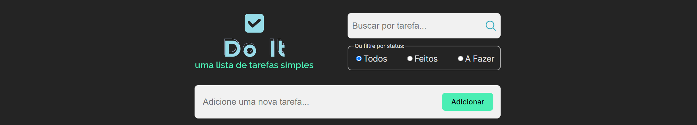

# ✔️ Lista de Tarefas | Do It



- **Descrição:** Projeto individual intitulado _“Javascript e React: Lista de tarefas”_ desenvolvido durante o _Módulo 5 - Frameworks, bibliotecas, tecnologias client-side/front-end + Postura profissional e Inovação_ do curso de formação _WebDev Full Stack JavaScript_ da _Resilia Educação_ em parceria com o programa _Códigos do Amanhã_ da _EBANX_.

- **Sobre:** O projeto consiste no desenvolvimento de um aplicativo de lista de tarefas utilizando JavaScript e React.

- **Objetivo:** Permitir que o usuário gerencie suas tarefas de forma eficiente: adicionando, editando, marcando como concluídas e deletando. O aplicativo possui recurso de filtragem e busca para facilitar a localização de tarefas específicas.

- **Link para acessar o app:** https://to-do-list-doneit.vercel.app/

## 🎨 Paleta de cores utilizada no projeto:


## Pré-requisitos:

Certifique-se de ter o Node.js instalado em seu sistema. Você pode baixá-lo em nodejs.org.
Node.js

## ⚙️ Como instalar o projeto:

- **Clone o repositório para seu sistema local:**

###### Com HTTPS:

```bash
git clone https://github.com/devtaw/to-do-list-doneit.git
```

###### Com SSH:

```bash
git clone git@github.com:devtaw/to-do-list-doneit.git
```

###### Com GitHub CLI:

```bash
git clone gh repo clone devtaw/to-do-list-doneit
```

- **Acesse o diretório do projeto:**

```bash
cd to-do-list-doneit
```

- **Instale as dependências do projeto:**

```bash
npm create vite@latest to-do-list-doneit -- --template react
```

```bash
npm install
```

- **Inicie o aplicativo:**

```bash
npm run dev
```

- **O aplicativo estará disponível no seu navegador pelo link:**

```bash
http://127.0.0.1:5173/
```

## 🤝 Colaboradora

<table>
  <tr>
    <td align="center">
      <a href="#">
        <br>
        <sub>
          <b>Tawany Simões (Taw)</b>
        </sub>
      </a>
    </td>
  </tr>
 </table>
